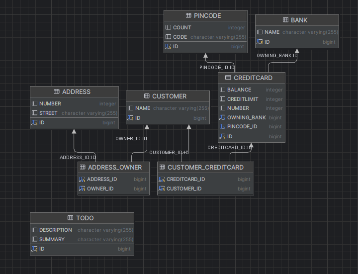

# DAT250-Lab3 Report

## Overview
Objective of assignment: Implement a simple model based on the schema provided in assignment description
and persist a few objects using JPA.

## Step 1: Domain Model
Based on the diagram provided in assignment description, I implemented a model for the 5 domain entities.
I added additional fields of the entities, as well as implemented the relationships between them while making
sure that they are exactly as specified on the diagram (uni/bidirectional, one-to-many, many-to-many).
I also updated the persistence.xml file with annotations of the newly added entities.

## Step 2: Persist objects
Based on the provided object diagram, I persisted a few objects in the CreateObjects() method of
CreditCardsMain class. Two things that needed to be taken into consideration were:
- for the bidirectional relationships, set the fields of the objects on both sides of the relationship
- persist objects in correct order (for example, persist the bank before setting it as owningBank for credit cards)

## Step 3: Testing
I ran the CreditCardsMainTest class and the test passed successfully.

## Step 4: Inspecting the database
The application was configured to use an H2 database, which stores the database in the DB.mv.db file.
To inspect the database, I used IntelliJ built-in database tool to connect into the H2 database.
This tool is also able to generate a diagram of the database:

After analyzing the diagram, the database looks as expected, with proper relationships and additional tables
created for the many-to-many relationships.

I also performed a few SQL queries to check the contents of the tables - they aligned with the contents of
the object diagram in assignment description.

## Technical difficulties
One technical problem I encountered was in regards to the DB.mv.db file. Due to the location of the project
on my computer, the path to the file contained a space character (" ") and because of that, I had problems
connecting into the database. I changed the hibernate.connection.url param in persistence.xml and specified
another location to the database file. After that, I had no trouble connecting into the database.
